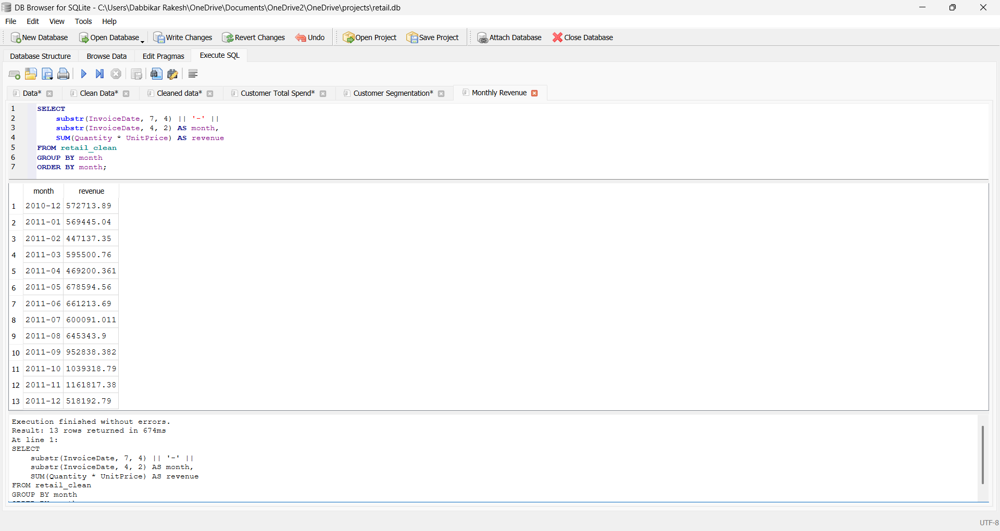
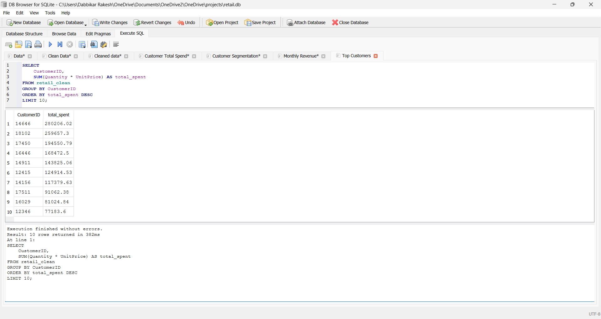
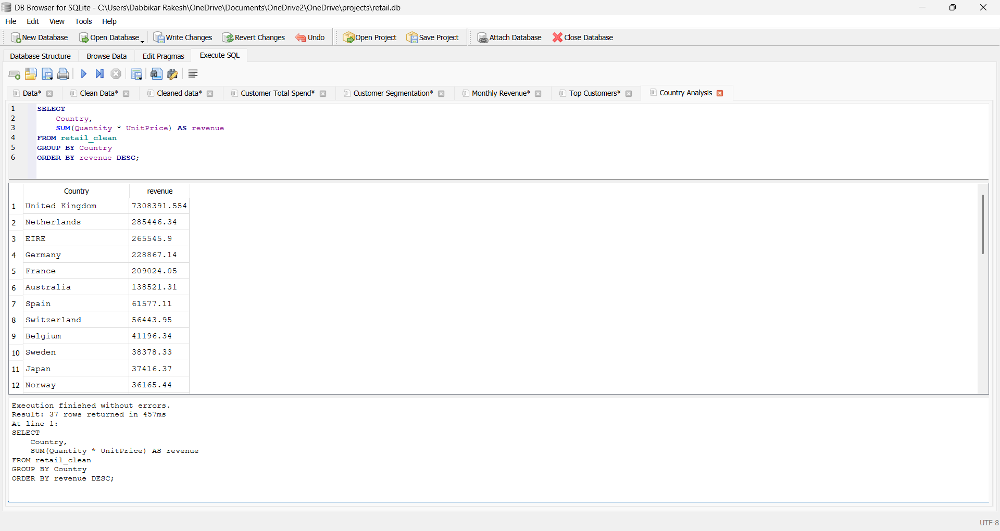
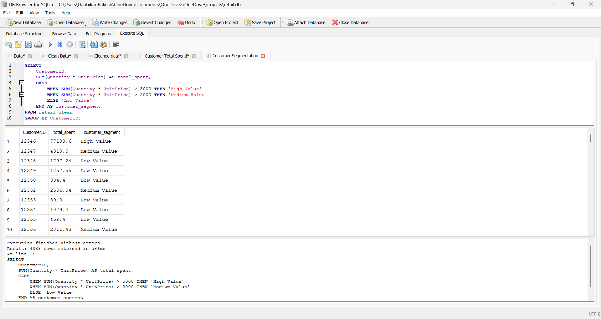
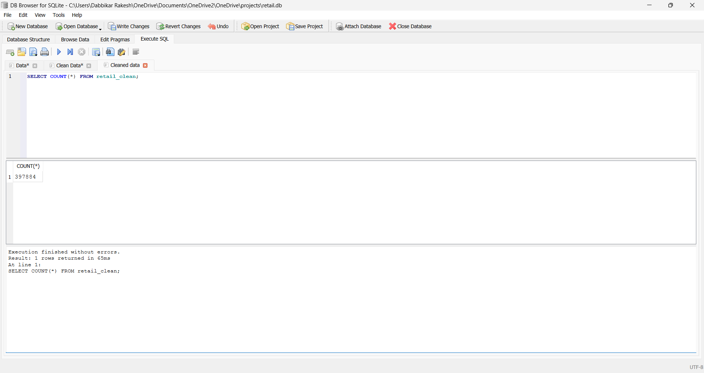
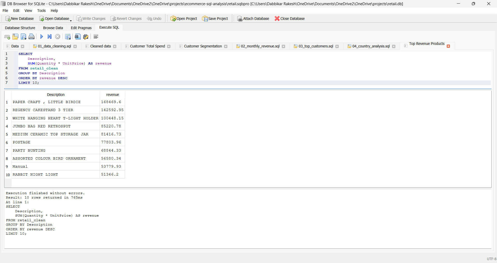

# Customer Segmentation & Retention Analysis (SQL)

## 📌 Project Overview

This project analyzes an e-commerce dataset using SQL to uncover:
- Customer segmentation
- Revenue trends
- Top customers
- Country-wise performance

Built end-to-end SQL analysis from raw dataset to business insights

---

## 📊 Dataset
Dataset is too large to upload.

Download from Kaggle:  
https://www.kaggle.com/datasets/tunguz/online-retail

---

## 🛠 Tools Used
- SQL (SQLite)
- DB Browser for SQLite

---

## 📈 Key Analysis

### 1. Data Cleaning
- Removed null CustomerID
- Removed negative/zero quantity & price

### 2. Monthly Revenue Trend
- Calculated revenue over time

### 3. Top Customers
- Identified highest spending customers

### 4. Customer Segmentation
- High Value (>5000)
- Medium Value (2000–5000)
- Low Value (<2000)

### 5. Country Analysis
- Revenue contribution by country

### 6. Top Products
- Highest revenue-generating products

---

## 📸 Screenshots

### Monthly Revenue

### Top Customers

### Country Analysis

### Customer Segmentation

### Cleaned Data Preview

### Revenue by Product

---

## 🚀 Key Insights
- Sales show strong growth trend over time
- A small group of customers contributes majority of revenue
- United Kingdom dominates revenue share
- High-value customers are critical for business growth

---

## 📁 Project Structure
customer-segmentation-retention-sql/

│

├── analysis.sql

├── README.md

└── screenshots/

---

## 💡 Conclusion
This project demonstrates strong SQL skills including:
- Data cleaning
- Aggregations
- Case statements
- Business insights generation
